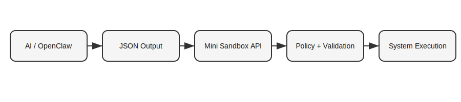

# Mini Sandbox

A minimal Rust-based safety layer for executing AI-generated commands on local systems.

---

## Concept

AI -> JSON -> API -> Sandbox -> System

The AI suggests commands.
Mini Sandbox validates and executes them safely.

---

## Architecture



---

## OpenClaw Integration

Mini Sandbox can be used as a safe execution layer for OpenClaw.

Flow:
OpenClaw -> JSON -> Mini Sandbox -> Safe Execution

Example JSON:
```
{ "command": "ls", "args": [] }
```

Use a simple bridge script to forward this JSON to the sandbox API.

---

## Features

- Whitelisted commands (ls, pwd, cat, echo)
- Blocks unsafe paths and arguments
- Runs inside ~/ai-lab/sandbox
- 3s execution timeout
- Clean environment (no leakage)
- Logs all executions

---

## Setup

```
git clone https://github.com/shreyanshvyas414/mini-sandbox.git
cd mini-sandbox

mkdir -p ~/ai-lab/sandbox

cargo run
```

---

## Usage

```
./scripts/agent_exec.sh ls
```
or
```
curl -X POST http://localhost:3000/execute \
-H "Content-Type: application/json" \
-d '{"command":"ls","args":[]}'
```

---

## Philosophy

Don't trust the model. Control the execution.
